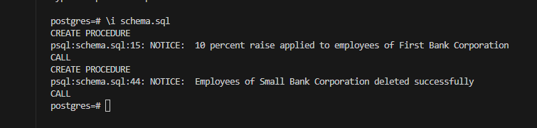
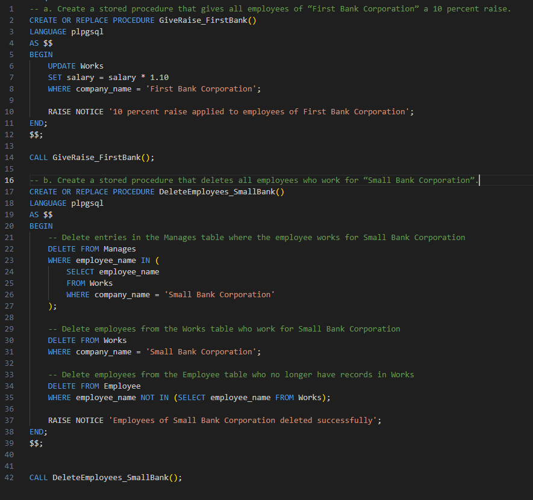

# DSC_E3.22

a. Create a stored procedure that gives all employees of “First Bank Corporation” a 10 percent raise.

b. Create a stored procedure that deletes all employees who work for “Small Bank Corporation”.

